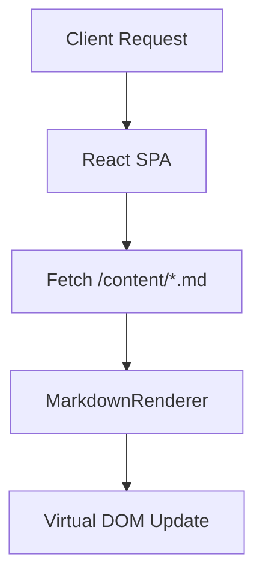

# System.Architecture

### Vision
To build an ultra-fast, stateless frontend consuming static markdown resources for maximum resilience.

### Requirements
- No database dependencies.
- Sub-second load times.
- Interactive, terminal-inspired user experience.

### Design

### Implementation
- **Data Layer**: Static `fetch()` calls on component mount via `Promise.all`.
- **View Layer**: React + TailwindCSS for UI.
- **Routing**: Anchor-based smooth scrolling.
