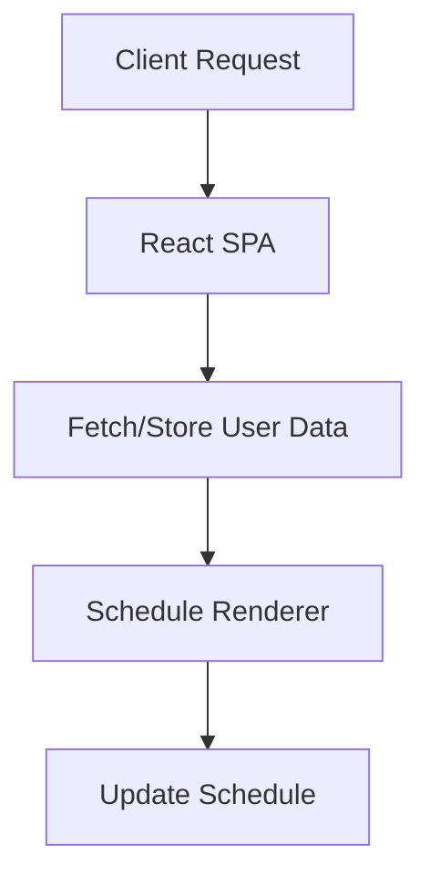

# System.Architecture

## Summary
This capstone project is a web app that helps users manage their time by automatically rearranging tasks around their classes, work, or unavailable hours, and provides a platform for collaboration on schedules.  

### Vision
To implementing an efficient solution to personal/collaborative time management problems using web-based technology.

### Requirements
- A web app with a user friendly interface
- Save repetitive schedules (weekly classes, team meetings, etc.)
- Feature for automatically rearranging tasks around classes, work, or unavailable hours.

### Design/Implementation

